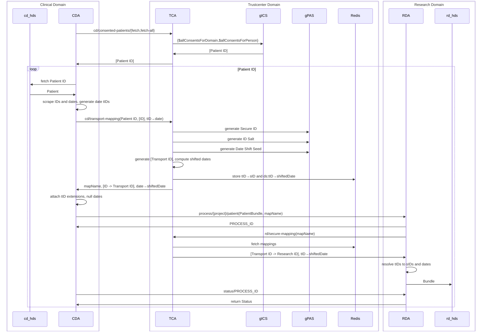

# FTSnext Development

Welcome to the developer documentation for the FHIR Transfer Services project! This document is
intended to guide developers through the codebase, architecture, and development practices.

***Note:** This documentation may be outdated, and we acknowledge its current limitations. We are
actively working to enhance and update this guide to provide a more comprehensive and up-to-date
resource for developers. Your feedback is valuable in this ongoing improvement process.*

