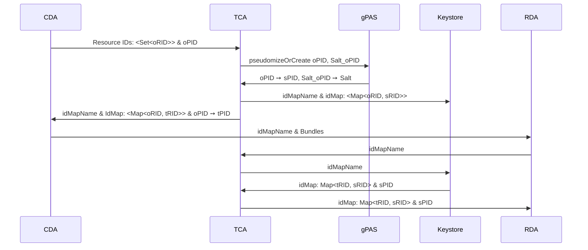

# Trustcenter Agent (TCA)

## Overview

The TCA is required to ensure that

## Consent

The TCA offers an endpoint to receive a cohort of consented patients
from [gICS](https://www.ths-greifswald.de/forscher/gics/).

## De-Identification

The de-identification process maps the original ids (oID) from the clinical domain to
pseudonyms (sID) in the research domain and shifts all dates by a random (but for each patient
fixed) amount.
In the clinical domain, before sending resources the oIDs are replaced with transport IDs (tID),
which are replaced with their corresponding sIDs in the research domain.
The dates are shifted two times.
First in the clinical domain and then a second time in the research domain.
The date shift value the research domain applies contains the negative date shift value of the
clinical domain, i.e.
the first date shift is undone.
This leads to a uniform distribution (w.r.t. all patients) of the date shift values.

The de-identification process works by generating a pseudonym for the patientID, which can be used
to re-identify patients.
The other ids are hashed with sha256.
Therefore, a second pseudonym is generated that is used as salt for the hashing algorithm.
Next, for each id a random transport id (tID) is generated and a Map of the oIDs to

The role of the TCA for the de-identification consists of two parts:
First, the Pseudonym Provider, provides a mechanism that replaces the IDs of the CDA domain with
pseudonyms for the RDA domain, such that it is, without the TCA, impossible to re-identify
neither the IDs of the CDA domain nor the pseudonyms of the RDA domain from the other domain.
Second, the Shifted Dates Provider, offers a way to time-shift dates.

### Pseudonym Provider

We distinguish between the Patient ID (PID) and other Resource IDs (RID)s.
The original PID (oPID) from the CDA domain is sent
to [gPAS](https://www.ths-greifswald.de/forscher/gpas/) where a pseudonym or secure PID (sPID)
is created.
The oRIDs are hashed with sha256 to create secure RIDs (sRID)s.
Since we have no influence about the ids' length we add salt to the hash function.
Therefore, we send the concatenation of "Salt_" + oPID to gPAS to create a pseudonym that is used as
salt.

Next we generate a random transport ID (tPID) for each original ID and return Map<oRID, tRID> and
oPID ➙ tPID to
the CDA.
The CDA replaces the original IDs with the transport IDs and sends the Bundle to the RDA.

The RDA asks the TCA to provide the secure IDs for the transport IDs and replaces the transport IDs.

