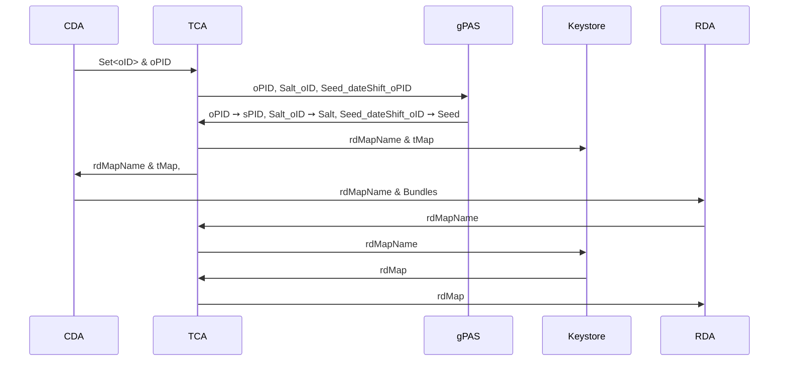

# Trustcenter Agent (TCA)

## Consent

The TCA offers an endpoint to receive a cohort of consented patients
from [gICS](https://www.ths-greifswald.de/forscher/gics/).

## De-Identification

The de-identification process maps the original resource IDs (oID) from the clinical domain to
pseudonyms (sID) in the research domain and shifts all dates by a random (but for each patient
fixed) duration.
For consistency, secure IDs and date shift values must remain stable across transfers, i.e.
multiple transfers of the same original IDs must generate identical secure IDs and date shift
values.

The role of the TCA consists of several parts:
First, it provides a mechanism that replaces the oIDs of the clinical domain with pseudonyms
in the research domain, in such a way that it impedes the re-identification
from the respective other domain.
Then, it manages a mechanism to time-shift dates to further improve the pseudonymization.
Last, the TCA enables to re-identify patients, if necessary.

Therefore, in a transfer process, the clinical domain agent requests from the trust center agent
the mapping from oIDs to transport IDs (tID) and a date shift value.
Then, before sending the patient bundle to the research domain agent,
the oIDs are replaced with tIDs and all dates are shifted by the date shift value.
After receiving the transport pseudonymized patient bundle, the research domain agent requests the
mapping from tIDs to sIDs and a date shift value and replaces the tIDs with the sIDs and applies
the date shift.

Thus, the dates are shifted two times.
First in the clinical domain and then in the research domain,
while the trust center agent is the only one that knows both date shift values.
The research domain agent receives its date shift value minus the one from the clinical domain
agent.
This effectively undoes the date shift of the transport pseudonymization
and leads to a uniform distribution of the date shift values amongst all patients.

### FhirMappingProvider

This section describes the implementation details of the FhirMappingProvider.

The de-identification process works by generating a pseudonym (sPID) in gPAS
for the patient resource's ID (PID).
The PID may be thought of as the main ID and is used to re-identify patients.
All other IDs are hashed with SHA256.
Since we have no influence about the ids' length
and to suppress re-identification from the clinical domain,
we use gPAS to generate a second pseudonym that we use as salt for the hash function.
In gPAS the key of the salt pseudonym is named "Salt_" + oID.

To generate the date shift values a third pseudonym is generated
in gPAS with the key named "DateShiftSeed_" + oPID.
The pseudonym is used as seed for a random number generator that generates the date shift values for
the clinical and research domains.

When the CDA requests a transport mapping (tMAP),
a random transport ID is generated for each oID and the oID ➙ tID mapping
together with the clinical domain date shift value is return it to the CDA.
The CDA replaces the original IDs with the transport IDs,
applies the date shift and sends the Bundle to the RDA.
The TCA generates and stores the research mapping (rdMap),
including the id mapping (tID ➙ sID) and the research domain date shift value,
temporarily in a key-value store.
The name of the research mapping (rdMapName) is sent to CDA, too, which forwards it to the RDA.

Then the RDA requests the research mapping (tID ➙ sID) and date shift value from the TCA
and replaces the transport IDs and applies the second date shift.

