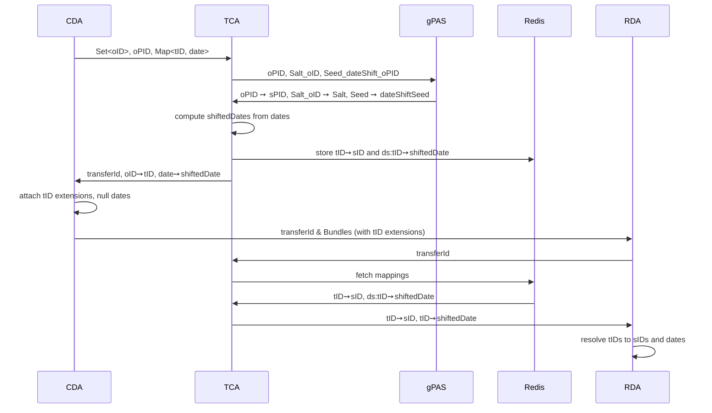

# De-Identification

The de-identification process maps the original resource IDs (oID) from the clinical domain to
pseudonyms (sID) in the research domain and shifts all dates by a random (but for each patient
fixed) duration.
For consistency, secure IDs and date shift values must remain stable across transfers, i.e.
multiple transfers of the same original IDs must generate identical secure IDs and date shift
values.

The role of the TCA consists of several parts:
First, it provides a mechanism that replaces the oIDs of the clinical domain with pseudonyms
in the research domain, in such a way that it impedes the re-identification
from the respective other domain.
Then, it manages a mechanism to time-shift dates to further improve the pseudonymization.
Last, the TCA enables to re-identify patients, if necessary.

## DateShift-ID Pattern

To ensure that date values never leave the clinical domain in their original form, FTSnext uses
the DateShift-ID Pattern. Instead of shifting dates directly at the CDA, transport IDs (tIDs) are
generated for each unique date value and attached as FHIR extensions. The actual date values are
nulled before transmission.

The transfer process works as follows:

1. **CDA scrapes dates**: The CDA generates a unique transport ID (tID) for each distinct date
   value found in the patient bundle and creates a tID→originalDate mapping.
2. **CDA requests transport mapping**: The CDA sends the resource IDs and tID→originalDate
   mappings to the TCA.
3. **TCA computes shifted dates**: The TCA generates date shift values (using a deterministic
   seed per patient) and computes shifted dates. It stores tID→shiftedDate mappings in Redis
   (prefixed with `ds:`) and returns originalDate→shiftedDate mappings to the CDA.
4. **CDA attaches extensions**: The CDA attaches tID extensions to date elements using the URL
   `https://fts.smith.care/fhir/StructureDefinition/date-shift-transport-id` and nulls the
   actual date values before sending the bundle to the RDA.
5. **RDA requests secure mapping**: The RDA requests the mapping for the transfer from the TCA.
6. **TCA returns mappings**: The TCA returns both the ID mappings (tID→sID) and the date shift
   mappings (tID→shiftedDate).
7. **RDA restores dates**: The RDA resolves the tID extensions to shifted dates and removes the
   extensions.

The dates are effectively shifted in two phases. The TCA generates separate shift values for the
clinical and research domains, but the mechanism ensures the RDA receives the final shifted dates
directly via the tID mappings. This leads to a uniform distribution of date shift values amongst
all patients while ensuring original dates never leave the clinical domain.

### FhirMappingProvider

This section describes the implementation details of the FhirMappingProvider.

The de-identification process works by generating a pseudonym (sPID) in gPAS
for the patient resource's ID (PID).
For more details on the pseudonymization approach, see the [Pseudonymization](pseudonymisierung)
document.
The PID may be thought of as the main ID and is used to re-identify patients.
All other IDs are hashed with SHA256.
Since we have no influence about the ids' length
and to suppress re-identification from the clinical domain,
we use gPAS to generate a second pseudonym that we use as salt for the hash function.
In gPAS the key of the salt pseudonym is named "Salt_" + oID.

To generate the date shift values a third pseudonym is generated
in gPAS with the key named "DateShiftSeed_" + oPID.
The pseudonym is used as seed for a random number generator that generates the date shift values.

When the CDA requests a transport mapping (tMap), it sends:
- A set of original resource IDs (oIDs)
- A map of date transport IDs to original date values (tID→originalDate)

The TCA then:
1. Generates a random transport ID for each oID
2. Computes shifted dates for each original date using the patient's date shift seed
3. Stores the research mapping in Redis, including:
   - ID mappings: tID→sID (hashed with salt)
   - Date mappings: ds:tID→shiftedDate (prefixed with `ds:`)
4. Returns to the CDA:
   - The oID→tID mappings
   - The originalDate→shiftedDate mappings
   - The transfer ID (rdMapName) for later resolution

The CDA uses the date mappings to find the correct tID for each date value, attaches it as a
FHIR extension, and nulls the date value before sending the bundle to the RDA.

The RDA then requests the secure mapping using the transfer ID. The TCA returns:
- ID mappings: tID→sID
- Date mappings: tID→shiftedDate (extracted from `ds:`-prefixed Redis entries)

The RDA resolves the tID extensions to shifted dates and removes the extensions.

