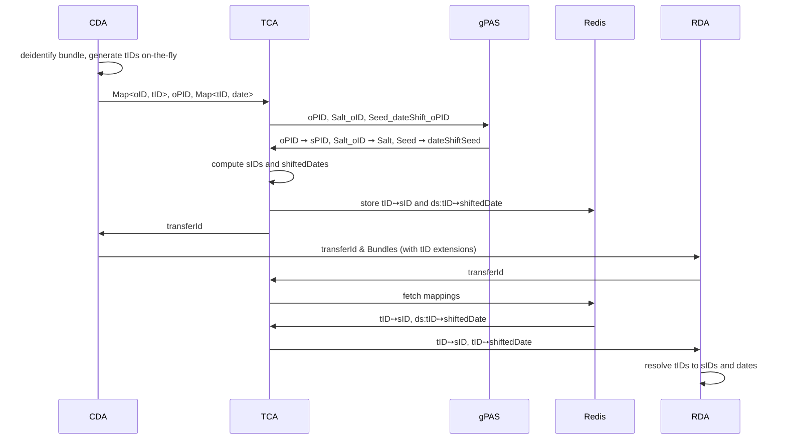

# De-Identification

The de-identification process maps the original resource IDs (oID) from the clinical domain to
pseudonyms (sID) in the research domain and shifts all dates by a random (but for each patient
fixed) duration.
For consistency, secure IDs and date shift values must remain stable across transfers, i.e.
multiple transfers of the same original IDs must generate identical secure IDs and date shift
values.

The role of the TCA consists of several parts:
First, it provides a mechanism that replaces the oIDs of the clinical domain with pseudonyms
in the research domain, in such a way that it impedes the re-identification
from the respective other domain.
Then, it manages a mechanism to time-shift dates to further improve the pseudonymization.
Last, the TCA enables to re-identify patients, if necessary.

## DateShift-ID Pattern

To ensure that date values never leave the clinical domain in their original form, FTSnext uses
the DateShift-ID Pattern. Instead of shifting dates directly at the CDA, transport IDs (tIDs) are
generated for each unique date value and attached as FHIR extensions. The actual date values are
nulled before transmission.

The transfer process works as follows:

1. **CDA deidentifies in a single pass**: The CDA runs DeidentiFHIR on the patient bundle,
   generating transport IDs (tIDs) on-the-fly for each unique resource ID and date value.
   Date values are replaced with tID extensions (using the URL
   `https://fts.smith.care/fhir/StructureDefinition/date-shift-transport-id`) and nulled
   during this same pass.
2. **CDA sends mappings to TCA**: The CDA sends the generated mappings — ID pairs
   (originalID, tID) and date pairs (tID, originalDate) — to the TCA.
3. **TCA computes and stores secure mappings**: The TCA generates a pseudonym (sPID) for the
   patient identifier via gPAS and computes secure IDs (sIDs) for all other IDs by hashing with
   a salt. It computes shifted dates using a deterministic seed per patient and stores all
   mappings (tID→sID and ds:tID→shiftedDate) in Redis. It returns only the `transferId` to
   the CDA.
4. **RDA requests secure mapping**: The RDA requests the mapping for the transfer from the TCA.
5. **TCA returns mappings**: The TCA returns both the ID mappings (tID→sID) and the date shift
   mappings (tID→shiftedDate).
6. **RDA restores dates**: The RDA resolves the tID extensions to shifted dates and removes the
   extensions.

The TCA generates a single date shift value per patient using a deterministic seed from gPAS and
applies it to all date values. The shifted dates are stored in Redis and returned to the RDA via
the tID mappings. Original dates are sent to the TCA for shift computation but never reach the
research domain — only the shifted dates are forwarded to the RDA.

### FhirMappingProvider

This section describes the implementation details of the FhirMappingProvider.

The de-identification process works by generating a pseudonym (sPID) in gPAS
for the patient resource's ID (PID).
For more details on the pseudonymization approach, see the [Pseudonymization](pseudonymisierung)
document.
The PID may be thought of as the main ID and is used to re-identify patients.
All other IDs are hashed with SHA256.
Since we have no influence about the ids' length
and to suppress re-identification from the clinical domain,
we use gPAS to generate a second pseudonym that we use as salt for the hash function.
In gPAS the key of the salt pseudonym is named "Salt_" + oID.

To generate the date shift values a third pseudonym is generated
in gPAS with the key named "DateShiftSeed_" + oPID.
The pseudonym is used as seed for a random number generator that generates the date shift values.

After deidentification, the CDA sends a transport mapping request to the TCA containing:
- ID pairs (originalID, tID) for each resource ID
- Date pairs (tID, originalDate) for each unique date value

The TCA then:
1. Generates a pseudonym (sPID) for the patient identifier via gPAS (used for re-identification)
2. Computes a secure ID (sID) for all other IDs by hashing with a salt
3. Computes shifted dates for each original date using the patient's date shift seed
4. Stores the research mapping in Redis, including:
   - ID mappings: tID→sID (hashed with salt)
   - Date mappings: ds:tID→shiftedDate (prefixed with `ds:`)
5. Returns only the `transferId` to the CDA

The RDA then requests the secure mapping using the transfer ID. The TCA returns:
- ID mappings: tID→sID
- Date mappings: tID→shiftedDate (extracted from `ds:`-prefixed Redis entries)

The RDA resolves the tID extensions to shifted dates and removes the extensions.

