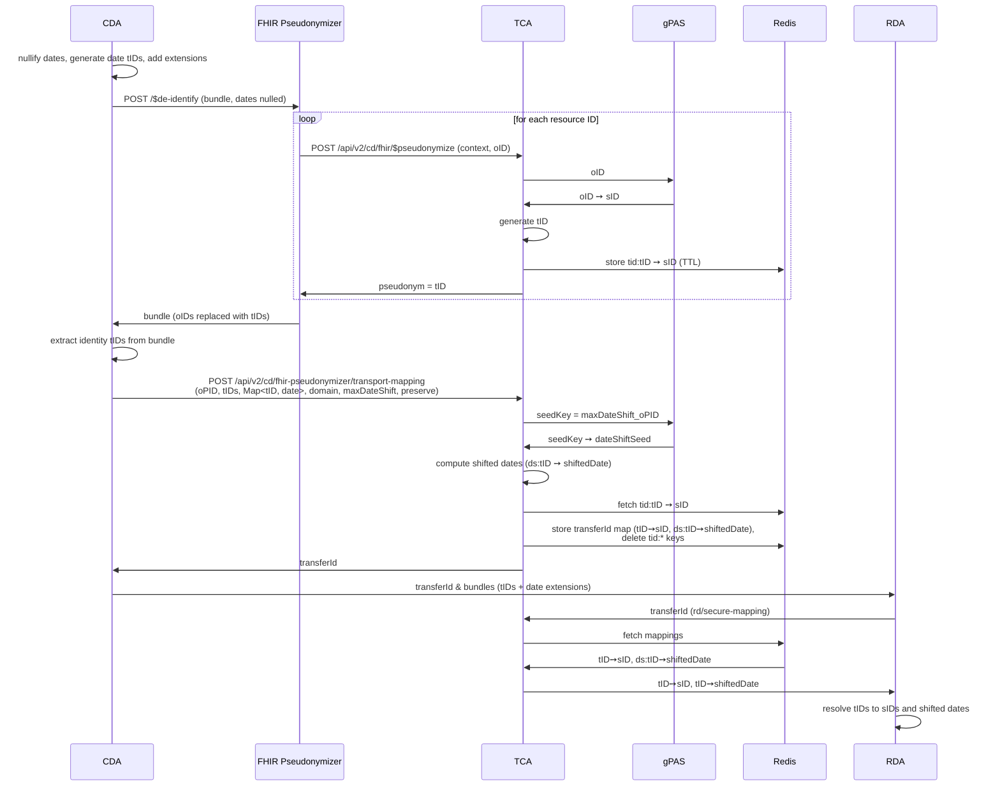

# FHIR Pseudonymizer De-Identification

The `fhir-pseudonymizer` deidentification step delegates ID pseudonymization to an external
[FHIR Pseudonymizer](https://github.com/miracum/fhir-pseudonymizer) (FP) service.
It differs from the [DeidentiFHIR flow](deidentification) in one point:
the CDA does not generate the identity transport IDs (tIDs) itself.
The FP replaces the resource IDs.
For each ID, the FP calls the TCA operation `$pseudonymize`
(MII Pseudonymization IG 2026.1.0) and receives a tID, never the real pseudonym (sID).

## Data Flow

## Step-by-Step

1. **CDA nullifies dates locally.** The CDA parses the dateshift rules from the FP anonymization
   config, generates a tID for each unique date value, adds a `date-shift-transport-id` extension,
   and nulls the date. The original dates stay in the CDA as `Map<tID, date>`.
2. **CDA sends the bundle to the FP.** `POST /$de-identify`. The dates are already null, so no
   original date reaches the FP.
3. **FP pseudonymizes IDs via the TCA.** For each ID, the FP calls `$pseudonymize`. The TCA
   fetches the sID from gPAS, generates a tID, stores `tid:tID ➙ sID` in Redis with a TTL, and
   returns only the tID. The FP never sees the sID.
4. **CDA consolidates via the TCA.** The CDA extracts the tIDs from the returned bundle and sends
   them together with the date mappings to `cd/fhir-pseudonymizer/transport-mapping`.
5. **TCA computes shifted dates and consolidates.** The TCA fetches the date-shift seed from gPAS
   (key `maxDateShift_oPID`), computes the shifted dates, merges the identity mappings and
   `ds:`-prefixed date entries into one Redis map keyed by a new `transferId`, and deletes the
   individual `tid:*` keys. It returns the `transferId`.
6. **RDA resolves.** The RDA fetches the consolidated mapping with the `transferId` via
   `rd/secure-mapping`, then resolves the tIDs to sIDs and shifted dates, as in the DeidentiFHIR
   flow.

## Data Isolation

- Original dates never leave the clinical domain. Only nulled dates plus tID extensions go to the
  FP and the RDA. Only `Map<tID, date>` goes to the TCA for shift computation.
- Real pseudonyms (sIDs) never enter the clinical domain. The FP and the CDA only see tIDs.

## RDA `$de-pseudonymize` Endpoint

The TCA also provides `rd/fhir/$de-pseudonymize` for an RDA-side FP. It resolves single tIDs from
the individual `tid:*` keys. Consolidation (step 5) deletes these keys, so after consolidation only
the `transferId`-based retrieval works. The two RDA paths are alternatives, not a sequence.
