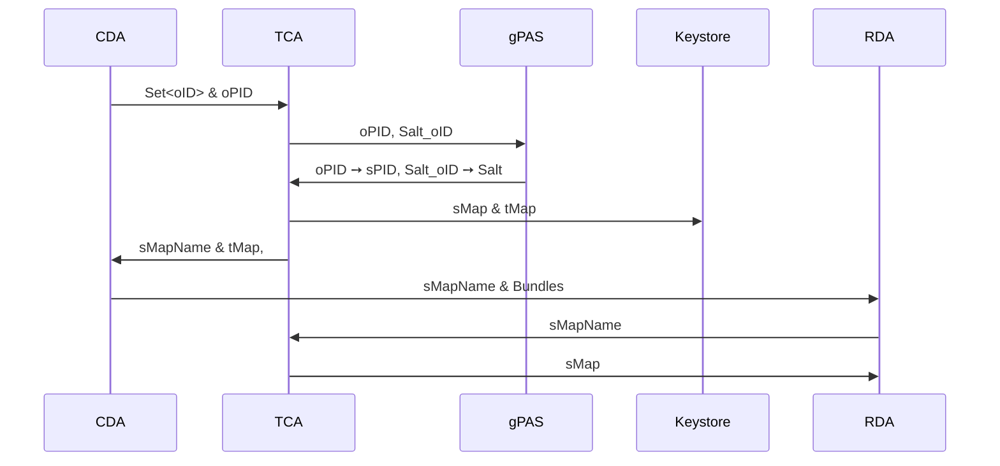

---
head:
- - link
  - rel: stylesheet
    href: https://cdnjs.cloudflare.com/ajax/libs/KaTeX/0.5.1/katex.min.css
---

::: info
This text is provided in German as it requires coordination with our data protection officer. Given
the sensitivity of data protection matters and the importance of precise wording to ensure the
intended meaning, we are proceeding in the original language to maintain clarity and compliance.
An english version can be found [here](./pseudonymization)
:::

# Pseudonymisierung

Bei der Pseudonymisierung werden die original IDs (oID) der klinischen Domäne (CD) in der
Forschungsdomäne (RD) durch Pseudonyme (sID) ersetzt.
Der Prozess ist mithilfe einer Treuhandstelle (TC) so gestaltet, dass

- die CD keine Kenntnis über die sID hat
- die RD keine Kenntnisse über die oID hat
- und die TC ihrerseits keine Kenntnis über den Inhalt der medizinischen Daten hat, siehe [1].

## Anforderungen

1. Der ID-Austauschprozess erfolgt über eine Treuhandstelle (TCA).
2. Eine Rückidentifizierung durch die Treuhandstelle muss möglich sein.
3. Die sIDs müssen bei wiederholten Übertragungen konstant bleiben.

## Übertragungsprozess

Die Datenübertragung wird durch jeweils einen Agenten in der klinischen Domäne (CDA), der
Forschungsdomäne (RDA) und der Treuhandstelle (TCA) gesteuert.

In einem Übertragungsprozess sendet der CDA eine Liste mit den zu pseudonymisierenden oIDs an den
TCA.
Die Patienten-ID (PID) wird hierbei gesondert behandelt, da sie zur Rückidentifizierung verwendet
wird.
Der TCA erzeugt ein Pseudonym für die oPID.
Als sID für die oIDs der verbleibenden Ressourcen wird ein Hash aus der jeweiligen oID berechnet.
Dazu erzeugt der TCA ein Salt, welches in der Hash-Funktion verwendet wird, um die damit erzeugten
sIDs vor Brute-Force-Angriffen zu schützen.

Anschließend erzeugt der TCA für jede oID eine Transport-ID (tID) und sendet das Transport-Mapping (
tMap: oID ➙ tID) an den CDA zurück.
Für die Forschungsdomäne wird ein Secure-Mapping erzeugt, das die tIDs auf die
sIDs mapped (sMap: tID ➙ sID).

Der Identifier für die sMap (sMapName) wird an den CDA übermittelt.
Dieser ersetzt im Patientenbundle zunächst die oIDs durch tIDs.
Anschließend sendet der CDA das transportpseudonymisierte Patientenbundle zusammen mit dem sMapName
an den RDA.
Nach Erhalt fordert der RDA die zugehörige sMap an und ersetzt die tIDs durch die sIDs.

Das folgende Diagramm veranschaulicht den Übertragungsprozess im Detail.



## Erzeugung der Transport-IDs und pseudonymisierten IDs

### sID

Der TCA verwendet gPAS zur Generierung und Speicherung von Pseudonymen.
Für jeden Patienten werden zwei Pseudonyme erzeugt:

$$
\begin{align*}
\text{oPID} &\rightarrow \text{sPID}\\
\text{"Salt\_"} + \text{oPID} &\rightarrow \text{Salt}
\end{align*}
$$

Als Schlüssel werden die oPID des Patienten und die Konkatenation von "Salt\_" und der oPID
verwendet.
Hierbei ist zu beachten, dass "Salt\_" ein feststehendes Literal und keine Variable oder ein
tatsächliches Salt ist.

Das erste Pseudonym pseudonymisiert die oPID der Patientenressource, d.h. es ist ein direktes
Mapping auf die sPID des Patienten, und kann zur Rückidentifizierung genutzt werden.
Das zweite Pseudonym wird als Salt für die Erzeugung der Pseudonyme für die restlichen Ressourcen
verwendet:

$$
\text{Ressourcen-sID} = \text{SHA256}(\text{Salt} + \text{oID})
$$

::: warning Sicherheitshinweis
Die Kombination aus Alphabetgröße $A$ und Salt-Länge $n$ — also $A^n$ mögliche Varianten — muss
ausreichend groß gewählt werden, um gegen Brute-Force-Angriffe resistent zu sein (siehe
Sicherheitsaspekte).
:::

#### Beispiel

Angenommen, wir haben im CDA einen Patienten mit zwei Ressourcen:

```
Patient:
  oID = 1,
  Ressourcen:
  [
    Encounter: oID = 2,
    MedicationAdministration: oID = 3
  ]
```

Der CDA sendet die zu pseudonymisierenden IDs (1, 2, 3) an den TCA.
Dieser generiert das Pseudonym für die oPID und das Salt:

$$
\begin{align*}
1 &\rightarrow \text{d7dsjdg4}\\
\text{Salt\_1} &\rightarrow \text{5kf8344f}
\end{align*}
$$

Mit dem Salt werden für IDs 2 und 3 SHA256 berechnet:

$$
\begin{align*}
2 &\rightarrow \text{SHA256}(5kf8344f2)\\
3 &\rightarrow \text{SHA256}(5kf8344f3)
\end{align*}
$$

### tID

Für jede oID wird eine zufällige Zahl generiert, die als tID dient.
Das Mapping

$$ \text{oID} \rightarrow \text{tID} $$

wird temporär in einem Key-Value-Store gespeichert, sodass tIDs bei erneuten Übertragungen
variieren.
Die Speicherdauer für die tIDs ist in der Konfiguration des TCA einstellbar.

### Transport-Mapping: Ersetzung der oIDs durch tIDs

Sobald der CDA die zu pseudonymisierenden oIDs an den TCA sendet, werden dort die temporäre
Transport-IDs (
tIDs) generiert und zusammen mit dem sMapName zurück an den CDA geschickt.
Der CDA ersetzt die oID mit den tID und übermittelt die Daten sowie den sMapName an den RDA.

**Beispiel für das Transport-Mapping:**
$$
\begin{align*}
1 &\rightarrow 84613221\\
2 &\rightarrow 34186571\\
3 &\rightarrow 97354168
\end{align*}
$$

```
transport-Patient:
  tID = 84613221,
  Ressourcen:
  [
    Encounter: tID = 34186571,
    MedicationAdministration: tID = 97354168
  ]
```

### Secure-Mapping

Nachdem der RDA das transportpseudonymisierte Bundle erhalten hat, fordert dieser vom TCA, mittels
des sMapNames, die
sMap an und ersetzt die tIDs durch die sIDs:
Die sIDs sind für Forschungszwecke bestimmt und bleiben für wiederholte Übertragungen konstant.

**Beispiel für das Secure-Mapping:**

$$
\begin{align*}
84613221 &\rightarrow \text{d7dsjdg4}\\
34186571 &\rightarrow \text{SHA256}(5kf8344f2)\\
97354168 &\rightarrow \text{SHA256}(5kf8344f3)
\end{align*}
$$

```
research-Patient:
 <sID = d7dsjdg4,
 Ressourcen: [
  Encounter: sID = SHA256(5kf8344f2),
  MedicationAdministration: sID = SHA256(5kf8344f3)
 ]
```

## Sicherheitsaspekte

### Salt Bruteforcen

Angenommen einer Angreiferin sind die oIDs und sIDs bekannt und sie versucht eine Beziehung zwischen
oIDs und sIDs herzustellen.
Dazu versucht sie mittels Brute-Force-Angriffen das Salt zu bestimmen.

Die Dauer $T$, die die Angreiferin benötigt, um das Salt zu bestimmen, ist durch

$$
T = \frac{A^n}{v}
$$
gegeben, wobei $A$ die Alphabetgröße, $n$ die Länge des Salts, und $v$ die Anzahl der Hashes pro
Sekunde sind.

Mit heutiger (Stand 2025) Hardware sind $10^{15}$ Hashes pro Sekunde für $ 25,000 und einem
Stromverbrauch von 15J/TH eine realistische Annahme.
Die Werte sind von aktuellen Verkaufsseiten von SHA256 Bitcoin-Mining Hardware entnommen.

| Alphabetgröße $(A)$ | Länge $(n)$ | Mögliche Kombinationen $(Aⁿ)$       | Zeit bei $10^{15}$ Hashes/Sekunde | Stromverbrauch in kWh bei 15 J/TH |
|---------------------|-------------|-------------------------------------|-----------------------------------|-----------------------------------|
| $26$ (Kleinbuchst.) | $12$        | $26^{12} \approx 9,5 \cdot 10^{16}$ | $95$ s                            | $4,0 \cdot 10^{-1}$               |
| $26$ (Kleinbuchst.) | $16$        | $26^{16} \approx 4,4 \cdot 10^{22}$ | $\sim 1,4$ Jahre                  | $1,8 \cdot 10^5$                  |
| $26$ (Kleinbuchst.) | $24$        | $26^{24} \approx 9,1 \cdot 10^{33}$ | $\sim 177$ Jahre                  | $3,8 \cdot 10^{16}$               |
| $62$ (Alphanum.)    | $12$        | $62^{12} \approx 3,2 \cdot 10^{21}$ | $\sim 38$ Tage                    | $1,3 \cdot 10^4$                  |
| $62$ (Alphanum.)    | $16$        | $62^{16} \approx 4,8 \cdot 10^{28}$ | $\sim 15$ Jahre                   | $2,0 \cdot 10^{11}$               |
| $62$ (Alphanum.)    | $24$        | $62^{24} \approx 1,0 \cdot 10^{43}$ | $\sim 3 \cdot 10^{20}$ Jahre      | $4,3 \cdot 10^{25}$               |

## Referenzen

* [1] [Leitfaden zum Datenschutz in medizinischen Forschungsprojekten](https://www.tmf-ev.de/unsere-arbeit/produkte/leitfaden-zum-datenschutz-in-medizinischen-forschungsprojekten)
    * Siehe 6.1.1.2 für Informationen über den Pseudonymisierungsdienst
