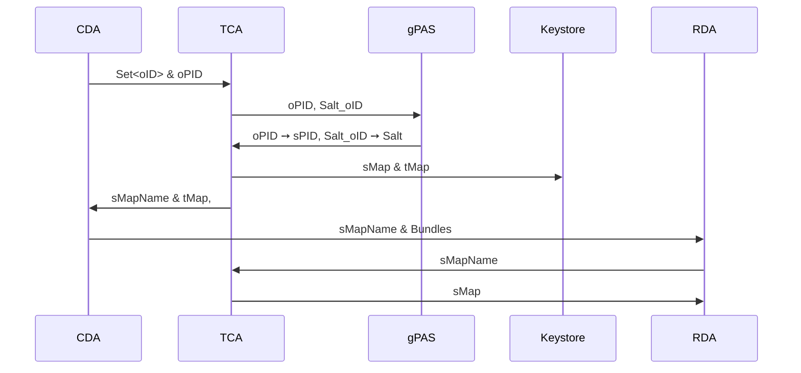

---
head:
- - link
  - rel: stylesheet
    href: https://cdnjs.cloudflare.com/ajax/libs/KaTeX/0.5.1/katex.min.css
---


::: info
This English text is a translation of the original German document,
[Pseudonymisierung](./pseudonymisierung), which was written to coordinate with our Data Protection
Officer.
It is provided for convenience; in case of discrepancies, the German version takes precedence.
:::

# Pseudonymization

In pseudonymization, the original IDs (oID) from the clinical domain (CD) are replaced with
pseudonyms (sID) in the research domain (RD).  
The process is designed with the help of a Trusted Center (TC) so that

- the CD has no knowledge of the sIDs,
- the RD has no knowledge of the oIDs,
- and the TC itself has no access to the medical data content (see [1]).

## Requirements

1. The ID exchange process is handled via a Trusted Center Agent (TCA).
2. Re-identification must be possible via the Trusted Center.
3. The sIDs must remain consistent across repeated transmissions.

## Transmission Process

Data transmission is managed by one agent each in the clinical domain (CDA), the research domain (
RDA), and the trusted center (TCA).

In a transmission process, the CDA sends a list of oIDs to be pseudonymized to the TCA.  
The patient ID (PID) is handled separately, as it is used for re-identification.

The TCA generates a pseudonym for the oPID.  
For the oIDs of other resources, a hash is calculated using a salt.  
The TCA generates the salt, which is used in the hash function to protect the resulting sIDs from
brute-force attacks.

Next, the TCA generates a transport ID (tID) for each oID and sends the transport mapping (tMap: oID
➙ tID) back to the CDA.  
A secure mapping (sMap: tID ➙ sID) is created for the research domain.

The identifier for the sMap (sMapName) is sent to the CDA.  
The CDA first replaces the oIDs with tIDs in the patient bundle, then sends the
transport-pseudonymized patient bundle and sMapName to the RDA.  
Upon receipt, the RDA requests the corresponding sMap and replaces the tIDs with sIDs.

The following diagram illustrates the transmission process in detail:



## Generation of Transport and Pseudonymized IDs

### sID

The TCA uses gPAS to generate and store pseudonyms.
For each patient, two pseudonyms are generated:

$$
\begin{align*}
\text{oPID} &\rightarrow \text{sPID}\\
\text{"Salt\_"} + \text{oPID} &\rightarrow \text{Salt}
\end{align*}
$$

The keys used are the oPID of the patient and the concatenation of the literal "Salt_" with the
oPID.
Note: "Salt_" is a fixed string, not a variable or real salt.

The first pseudonym maps the patient oPID directly to a sPID and can be used for re-identification.
The second pseudonym acts as a salt for the other resource IDs:

$$
\text{Ressourcen-sID} = \text{SHA256}(\text{Salt} + \text{oID})
$$

::: warning Security Note
The combination of alphabet size $A$ and salt length $n$—i.e., $A^n$ possible variants—must be
chosen large enough to resist brute-force attacks (see security aspects).
:::

### Example

Suppose there is a patient in the CDA with two resources:

```
Patient:
  oID = 1,
  Ressourcen:
  [
    Encounter: oID = 2,
    MedicationAdministration: oID = 3
  ]
```

The CDA sends the oIDs (1, 2, 3) to the TCA.
The TCA generates:

$$
\begin{align*}
1 &\rightarrow \text{d7dsjdg4}\\
\text{Salt\_1} &\rightarrow \text{5kf8344f}
\end{align*}
$$

Using the salt, the TCA computes:

$$
\begin{align*}
2 &\rightarrow \text{SHA256}(5kf8344f2)\\
3 &\rightarrow \text{SHA256}(5kf8344f3)
\end{align*}
$$

### tID

For each oID, a random number is generated as the tID.

The mapping:

$$ \text{oID} \rightarrow \text{tID} $$

is temporarily stored in a key-value store.
Thus, tIDs can vary on repeated transfers.
The retention time of tIDs is configurable in the TCA.

### Transport Mapping: Replacing oIDs with tIDs

Once the CDA sends the oIDs to be pseudonymized to the TCA, temporary transport IDs (tIDs) are
generated and sent back with the sMapName.
The CDA replaces the oIDs with tIDs and sends the data and sMapName to the RDA.

Example Transport Mapping:
$$
\begin{align*}
1 &\rightarrow 84613221\\
2 &\rightarrow 34186571\\
3 &\rightarrow 97354168
\end{align*}
$$

```
transport-Patient:
  tID = 84613221,
  Ressourcen:
  [
    Encounter: tID = 34186571,
    MedicationAdministration: tID = 97354168
  ]
```

### Secure Mapping

After receiving the transport-pseudonymized bundle, the RDA requests the sMap using the sMapName and
replaces the tIDs with sIDs.
The sIDs are intended for research purposes and remain stable across transfers.

**Example Secure Mapping:**

$$
\begin{align*}
84613221 &\rightarrow \text{d7dsjdg4}\\
34186571 &\rightarrow \text{SHA256}(5kf8344f2)\\
97354168 &\rightarrow \text{SHA256}(5kf8344f3)
\end{align*}
$$

```
research-Patient:
 <sID = d7dsjdg4,
 Ressourcen: [
  Encounter: sID = SHA256(5kf8344f2),
  MedicationAdministration: sID = SHA256(5kf8344f3)
 ]
```

## Security Aspects

### Salt Brute-Forcing

Suppose an attacker knows both oIDs and sIDs and attempts to determine the mapping using
brute-force.

The time $T$ needed to determine the salt is given by:

$$
T = \frac{A^n}{v}
$$

where $A$ is the alphabet size, $n$ the salt length, and $v$ the number of hashes per second.

As of 2025, hardware capable of $10^{15}$ SHA256 hashes per second is realistically available
for $25,000, consuming 15 J/TH.
These figures are based on SHA256 Bitcoin mining hardware.

| Alphabet Size $(A)$ | Length $(n)$ | Possible Combinations $(Aⁿ)$        | Time @ $10^{15}$ Hashes/sec  | Power Use (15 J/TH) in kWh |
|---------------------|--------------|-------------------------------------|------------------------------|----------------------------|
| $26$ (lowercase)    | $12$         | $26^{12} \approx 9,5 \cdot 10^{16}$ | $95$ s                       | $4,0 \cdot 10^{-1}$        |             
| $26$ (lowercase)    | $16$         | $26^{16} \approx 4,4 \cdot 10^{22}$ | $\sim 1,4$ years             | $1,8 \cdot 10^5$           |        
| $26$ (lowercase)    | $24$         | $26^{24} \approx 9,1 \cdot 10^{33}$ | $\sim 177$ years             | $3,8 \cdot 10^{16}$        |       
| $62$ (alphanumeric) | $12$         | $62^{12} \approx 3,2 \cdot 10^{21}$ | $\sim 38$ days               | $1,3 \cdot 10^4$           |        
| $62$ (alphanumeric) | $16$         | $62^{16} \approx 4,8 \cdot 10^{28}$ | $\sim 15$ years              | $2,0 \cdot 10^{11}$        |                 
| $62$ (alphanumeric) | $24$         | $62^{24} \approx 1,0 \cdot 10^{43}$ | $\sim 3 \cdot 10^{20}$ years | $4,3 \cdot 10^{25}$        |                                  

## References

* [1] [Leitfaden zum Datenschutz in medizinischen Forschungsprojekten](https://www.tmf-ev.de/unsere-arbeit/produkte/leitfaden-zum-datenschutz-in-medizinischen-forschungsprojekten)
  * Siehe 6.1.1.2 für Informationen über den Pseudonymisierungsdienst
