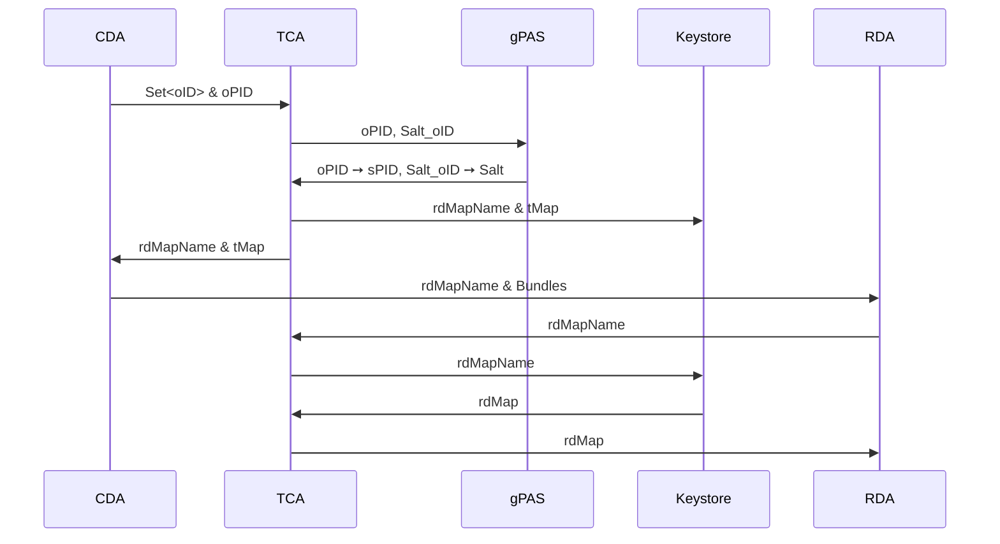

---
head:
- - link
  - rel: stylesheet
    href: https://cdnjs.cloudflare.com/ajax/libs/KaTeX/0.5.1/katex.min.css
---


::: info
This English text is a translation of the original German document,
[Pseudonymisierung](./pseudonymisierung), which was written to coordinate with our Data Protection
Officer.
It is provided for convenience; in case of discrepancies, the German version takes precedence.
:::

# Pseudonymization

In pseudonymization, the original IDs (oID) of the clinical domain (CD) are replaced with
pseudonyms (sID) in the research domain (RD).
The process is designed via a trusted third party domain so that the CD has no knowledge of the sID,
and the RD has no knowledge of the oID.

## Requirements

1. The ID exchange process takes place via a trusted third party (TCA).
2. Re-identification must be possible by the TCA.
3. sIDs must remain consistent across repeated transmissions.

## Transmission Process

Data transmission is managed by an agent in each of the clinical domain (CDA), the research domain
(RDA), and the trusted third party (TCA).

During the transmission process, the CDA sends a list of oIDs to be pseudonymized to the TCA.
The patient ID (PID) is treated separately, as it is used for re-identification.
The TCA generates a pseudonym for the oPID.
For the oIDs of the remaining resources, a hash is computed to generate sIDs.
To this end, the TCA generates a salt that is used in the hash function to protect the resulting
sIDs from brute-force attacks.

The TCA then generates a transport ID (tID) for each oID and sends a transport mapping
(tMap: oID ➙ tID) back to the CDA.
For the research domain, a mapping is created that maps the tIDs to the sIDs (rdMap: tID ➙ sID).

The identifier for the rdMap (rdMapName) is sent to the CDA.  
The CDA then replaces the oIDs in the patient bundle with tIDs and sends the transport-pseudonymized
bundle along with the rdMapName to the RDA.
Upon receipt, the RDA requests the associated rdMap and replaces the tIDs with the sIDs.

The following diagram illustrates the transmission process in detail:


```mermaid
sequenceDiagram
    CDA ->> TCA: Set<oID> & oPID
    TCA ->> gPAS: oPID, Salt_oID
    gPAS ->> TCA: oPID ➙ sPID, Salt_oID ➙ Salt
    TCA ->> Keystore: rdMapName & tMap
    TCA ->> CDA: rdMapName & tMap
    CDA ->> RDA: rdMapName & Bundles
    RDA ->> TCA: rdMapName
    TCA ->> Keystore: rdMapName
    Keystore ->> TCA: rdMap
    TCA ->> RDA: rdMap
```

## Generation of Transport IDs and Pseudonymized IDs

### sID

The TCA uses gPAS for generating and storing pseudonyms.
Two pseudonyms are created for each patient:

$$
\begin{align*}
\text{oPID} &\rightarrow \text{sPID}\\
\text{"Salt\_"} + \text{oPID} &\rightarrow \text{Salt}
\end{align*}
$$

The keys are the patient's oID and the concatenation of `"Salt_"` and the oID.
Note that `"Salt_"` is a fixed literal, not a variable or actual salt.

The first pseudonym replaces the oID of the patient resource and can be used for re-identification.
The second pseudonym is used as a salt for generating pseudonyms for the other resources:

$$
\text{Resource-sID} = \text{SHA256}(\text{Salt} + \text{oID})
$$

::: warning Security Notice
The combination of alphabet size $A$ and salt length $n$ — i.e., $A^n$ possible variants — must be
chosen large enough to resist brute-force attacks (see Security Aspects).
:::

#### Example

Suppose we have a patient with two resources:

  ```
  Patient:
    oID = 1,
    Ressourcen:
    [
      Encounter: oID = 2,
      Medication: oID = 3
    ]
  ```

The CDA sends the IDs to be pseudonymized (1, 2, 3) to the TCA.
It generates the pseudonym for the oPID and the salt:

$$
\begin{align*}
1 &\rightarrow \text{d7dsjdg4}\\
\text{Salt\_1} &\rightarrow \text{5kf8344f}
\end{align*}
$$

For IDs 2 und 3 SHA256 are computed with the salt:

$$
\begin{align*}
2 &\rightarrow \text{SHA256}(5kf83442)\\
3 &\rightarrow \text{SHA256}(5kf83443)
\end{align*}
$$

### tID

For each oID, a random number is generated as the tID.
The mapping

$$
\text{oID} \rightarrow \text{tID}
$$

is temporarily stored in a key-value store so that tIDs vary across repeated transmissions.
The storage duration of the tIDs is configurable in the TCA settings.

### Transport Mapping: Replacing oIDs with tIDs

Once the CDA sends the oIDs to be pseudonymized to the TCA, temporary transport IDs (tIDs) are
generated and returned to the CDA along with the `rdMapName`.
The CDA replaces the oIDs with the tIDs and sends the data and `rdMapName` to the RDA.

**Example Transport Mapping:**
$$
\begin{align*}
1 &\rightarrow 84613221\\
2 &\rightarrow 34186571\\
3 &\rightarrow 97354168
\end{align*}
$$

```
transport-Patient:
  tID = 84613221,
  Ressourcen:
  [
    Encounter: tID = 34186571,
    Medication: tID = 97354168
  ]
```

### Research Mapping

After receiving the transport-pseudonymized bundle, the RDA requests the `rdMap` from the TCA using
the `rdMapName` and replaces the tIDs with sIDs.
These sIDs are intended for research use and remain consistent across repeated transmissions.

**Example Research Mapping:**

$$
\begin{align*}
84613221 &\rightarrow \text{d7dsjdg4}\\
34186571 &\rightarrow \text{SHA256}(5kf83442)\\
97354168 &\rightarrow \text{SHA256}(5kf83443)
\end{align*}
$$

```
research-Patient:
 <sID = d7dsjdg4,
 Ressourcen: [
  Encounter: sID = SHA256(5kf83442),
  Medication: sID = SHA256(5kf83443)
 ]
```

## Security Aspects

### Salt Brute-Forcing

Assume an attacker knows the oIDs and sIDs and tries to establish a relationship between them.
They attempt to determine the salt via brute-force attacks.

The time $T$ required to determine the salt is given by:

$$
T = \frac{A^n}{v}
$$

Where:

- $A$ is the alphabet size
- $n$ is the salt length
- $v$ is the number of hashes per second

With modern hardware, $10^{15}$ hashes per second is a realistic assumption for $25,000 and a power
consumption of 15W/TH.
The values are based on current SHA256 Bitcoin mining hardware listings (as of 2025).

| Alphabet Size $(A)$ | Length $(n)$ | Possible Combinations $(A^n)$       | Time at $10^{15}$ Hashes/Sec | Power Consumption at 15W/TH (kWh) |
|---------------------|--------------|-------------------------------------|------------------------------|-----------------------------------|
| 26 (lowercase)      | 12           | $26^{12} \approx 9.5 \cdot 10^{16}$ | 95 s                         | $1.4 \cdot 10^3$                  |
| 26 (lowercase)      | 16           | $26^{16} \approx 4.4 \cdot 10^{22}$ | ~1.4 years                   | $6.5 \cdot 10^8$                  |
| 26 (lowercase)      | 24           | $26^{24} \approx 9.1 \cdot 10^{33}$ | ~177 years                   | $1.4 \cdot 10^{20}$               |
| 62 (alphanumeric)   | 12           | $62^{12} \approx 3.2 \cdot 10^{21}$ | ~38 days                     | $4.8 \cdot 10^7$                  |
| 62 (alphanumeric)   | 16           | $62^{16} \approx 4.8 \cdot 10^{28}$ | ~15 years                    | $7.1 \cdot 10^{14}$               |
| 62 (alphanumeric)   | 24           | $62^{24} \approx 1.0 \cdot 10^{43}$ | ~$3 \cdot 10^{20}$ years     | $1.5 \cdot 10^{29}$               |
