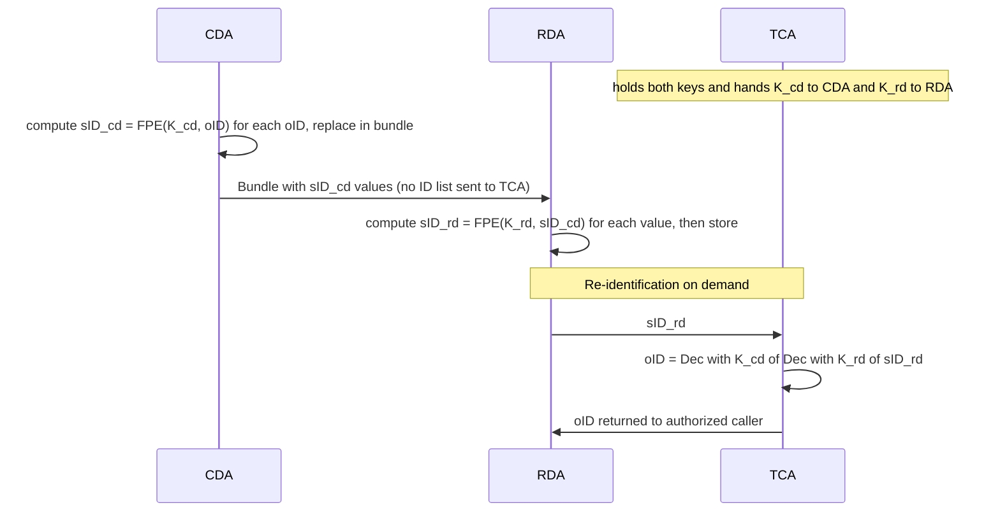

# Reversible (Encryption-Based) Pseudonymization

::: warning Status: Proposal
This document describes a **proposed** change to the de-identification workflow. It is not yet
implemented. Its purpose is to capture the idea and to record an honest analysis of whether it is
sound, including the design decisions that must be settled before any implementation begins.
:::

## Motivation

Two problems with the current [DateShift-ID Pattern](deidentification.md) drive this proposal.

**1. One-way pseudonyms block re-identification.** The secure ID for every non-patient resource is
a one-way hash:

```
sID = SHA256(Salt_oID + oID)
```

Only the patient identifier is reversible (gPAS retains `oPID → sPID`). Every other ID is hashed,
so a resource sID in the research domain **cannot be mapped back** to its clinical oID. That blocks
resource-level re-identification (return-of-findings, correcting/re-fetching a resource, re-firing
a resource).

**2. The transport mapping does not scale.** The current scheme sends a per-resource ID mapping
between the agents and the TCA. For patients with many resources this overflows the WebFlux buffer
([#812](https://github.com/medizininformatik-initiative/fts-next/issues/812):
`DataBufferLimitException: Exceeded limit on max bytes to buffer : 262144`). We want to **stop
shipping large ID lists between agents** entirely.

The idea solves both at once: replace the one-way hash with **reversible symmetric encryption**
that each agent applies **locally**, so no bulk ID mapping is exchanged during a transfer, and any
pseudonym can be turned back into its oID by the party holding the keys.

## Proposed Approach

### Local encryption with distributed keys

The TCA owns two symmetric keys and distributes one to each domain agent:

- `K_cd` — held by the **CDA**.
- `K_rd` — held by the **RDA**.
- The **TCA retains both**, used only for on-demand re-identification.

The CDA encrypts IDs locally as it de-identifies; the RDA adds a second layer locally on receipt:

```
sID_cd = Enc_{K_cd}(oID)              // computed at the CDA, no TCA round-trip
sID_rd = Enc_{K_rd}(sID_cd)           // computed at the RDA, no TCA round-trip
```

Re-identification reverses both layers, and only the TCA can do it because only the TCA holds both
keys:

```
oID = Dec_{K_cd}( Dec_{K_rd}(sID_rd) )
```

Because the encryption is local, **no per-resource ID mapping is sent between the agents and the
TCA** — directly addressing [#812](https://github.com/medizininformatik-initiative/fts-next/issues/812).
The only TCA round-trip for IDs is re-identification, which is on-demand and rare (and can be
batched).

### Why two keys

The two-key split gives genuine **separation of duties by construction**:

- A compromised **CDA** holds only `K_cd`; it cannot reverse data at rest in the research domain
  (that needs `K_rd`).
- A compromised **RDA** holds only `K_rd`; it can strip its own layer but cannot reach `oID`
  (that needs `K_cd`).
- Only the **TCA**, holding both, can complete a re-identification.

This is the property the design is after, and it depends on the keys actually living in *different*
custody. (A single key, or both keys in one place, would not provide it.)

### Choice of cipher: Format-Preserving Encryption

For the encrypted ID to be usable as a FHIR `id` and to keep the doubly-encrypted value bounded,
the ciphertext must fit the FHIR `id` rules (≤ 64 chars, charset `[A-Za-z0-9.-]`). The current
64-char hex sID already sits *at* that limit, so any length expansion breaks it. Standard
authenticated encryption (e.g. AES-SIV) expands the output by a 16-byte tag per layer and does not
fit, especially when applied twice.

**Format-Preserving Encryption (FPE), NIST SP 800-38G, algorithm FF1**, produces ciphertext of the
**same length and the same alphabet** as the plaintext. Therefore:

```
len(FPE_{K_rd}(FPE_{K_cd}(oID))) == len(oID)
```

A double-FPE pseudonym is the **same length as the original oID** and stays within the same
character set — so if `oID` was a valid FHIR `id`, so is `sID_rd`. FPE is deterministic, which
preserves the stability requirement ("multiple transfers of the same original IDs must generate
identical secure IDs"). Use **FF1**, not FF3-1 (FF3 had cryptanalytic attacks).

Other length options were rejected: CTR/stream ciphers preserve byte length but emit arbitrary
bytes (encoding re-expands them in a restricted charset) and cannot be safely deterministic;
wide-block ciphers (HCTR2, AEZ) likewise emit arbitrary bytes. FPE is the only construction that
preserves length *in the target alphabet*.

### The patient identifier becomes an ordinary ID

::: info Note
Today the patient identifier is the **one** ID given a reversible pseudonym (the gPAS `sPID`),
while every other ID is hashed. Once FPE makes **all** IDs reversible and uniform, the patient ID
no longer needs special treatment — it is just another `oID`, encrypted as `FPE(K_cd, oID)` like
any technical ID. **gPAS is then no longer required to pseudonymize the patient ID**, and the
special-case path (gPAS `sPID`, `Salt_oID`, `DateShiftSeed_oPID`) disappears.
:::

This is a real simplification, but note two consequences before treating it as free:

- **Cross-institution patient linkage.** The gPAS patient pseudonym is not just a local reversible
  ID — in the MII/TTP ecosystem it is the linkage key that lets the *same* patient be correlated
  across projects and sites. A site-local FPE key produces pseudonyms that do **not** align with
  another DIC's. Dropping gPAS for the patient ID trades MII-wide patient linkage for local
  uniformity. This is the [gPAS/MII interoperability](#privacy-and-governance-trade-offs-not-just-crypto)
  concern below, but most acute here.
- **Date-shift seed.** The per-patient date-shift seed currently derives from the patient's gPAS
  pseudonym (`DateShiftSeed_oPID`). Removing gPAS for the patient ID removes that source, so the
  seed must become key-derived — see the [date-shift open question](#open-questions).

### Proposed flow



Date shifting is intentionally left out of this diagram — see the open question below.

## Compatibility With Both De-Identification Paths

Both current paths produce the secure ID at a point that can be replaced by local FPE:

- **DeidentifhirStep** — replace the TCA's `SHA256(Salt + oID)` computation with the agent-local
  `FPE(K_cd, oID)` (and the RDA's `FPE(K_rd, ·)` layer on receipt). The transport-mapping
  round-trip for IDs is removed.
- **fhir-pseudonymizer** (epic `fp-mii-pseudonymization-interface`) — the external service today
  delegates ID transformation to the TCA's MII `$pseudonymize`. A local-FPE model changes this
  shape: the transform must happen with the agent's key rather than as a TCA call. This needs
  design attention — the fhir-pseudonymizer integration assumes a service callback, so either the
  callback target performs FPE with the distributed key, or the FPE step runs outside the
  fhir-pseudonymizer. Confirm this fits before assuming parity.

## Soundness Analysis

Honest verdict: **with FPE and distributed keys, the idea is sound and addresses both the
re-identification gap and [#812](https://github.com/medizininformatik-initiative/fts-next/issues/812).**
The remaining risks are specific and manageable, but real — most stem from FPE being unauthenticated
and from moving keys out to the agents.

### What the idea gets right

- **It achieves both goals.** Encryption is reversible (hashing is not), and local encryption
  removes the bulk ID exchange that causes [#812](https://github.com/medizininformatik-initiative/fts-next/issues/812).
- **FPE removes the length problem.** Same-length, same-alphabet output fits the FHIR `id` limit
  even after double encryption.
- **Two keys give real separation of duties** under distributed custody (see above).
- **Re-identification becomes stateless.** The key *is* the secret; no growing reverse-map store.

### Load-bearing decisions and residual risks

1. **FPE is unauthenticated — by design.** Same-length output means there is no integrity tag. A
   corrupted or tampered pseudonym decrypts to a **syntactically valid but wrong `oID`**, silently.
   In a re-identification context this means returning *the wrong patient* — a safety and privacy
   harm. Mitigation must be explicit: rely on transport/storage integrity (TLS, DB integrity), keep
   an authenticated copy at rest outside the `id` field, and/or validate re-identification results
   before acting on them.

2. **FPE small-domain weakness.** FPE security depends on a sufficiently large plaintext space
   (NIST guidance: `radix^minlen ≥ 1,000,000`). UUIDs / Blaze logical IDs are large enough; short
   codes or low-entropy identifiers are not. The actual shape of the oIDs must be checked.

3. **Alphabet handling.** FPE operates over a fixed alphabet. oIDs must be expressible in an
   alphabet ⊆ `[A-Za-z0-9.-]`; identifiers containing other characters need normalization or an
   encoding step (which must itself stay length-safe).

4. **Distributed keys widen the attack surface.** Keys now live at the CDA and RDA, not only inside
   the trust center. This is the cost of avoiding the round-trip. The two-key split limits the blast
   radius (one agent's key alone does not enable re-identification), but agent key storage must be
   hardened (HSM/keystore, no key in logs/config dumps).

5. **On-the-wire linkability returns.** Today the transit bundle carries random per-transfer tIDs,
   so an interceptor cannot link two transfers by ID. With deterministic local FPE, the bundle
   carries a stable `FPE(K_cd, oID)`, which *is* linkable across transfers. TLS mitigates an
   external interceptor, but this is a deliberate reduction of the current transport-layer property
   and should be acknowledged.

6. **Key rotation vs. linkability.** Deterministic encryption ties stable pseudonyms to a fixed
   key. Rotating a key changes all pseudonyms, breaking linkage with prior data and breaking
   re-identification of historical data unless old keys are retained and versioned. A rotation +
   key-version policy must exist before go-live. (gPAS absorbs this today via its own store; the
   proposal moves the burden into key management.)

### Privacy and governance trade-offs (not just crypto)

- **Universal reversibility is a deliberate weakening of de-identification.** Today resource-level
  re-identification is impossible by construction. After this change all transferred data becomes
  reversible to whoever holds the keys; **compromise of both keys equals mass re-identification of
  every transfer ever made.** This argues for HSM-backed keys, strict access control, and audit
  logging on every decryption. It is a governance decision, not a drop-in optimization.
- **gPAS / MII interoperability.** gPAS pseudonyms tie into consent and domain governance in the
  MII/TTP ecosystem and may be expected by downstream tooling. Replacing gPAS-derived sIDs with
  FPE ciphertext may decouple research datasets from that governance. This is most consequential
  for the **patient pseudonym**: dropping gPAS for the patient ID (see
  [The patient identifier becomes an ordinary ID](#the-patient-identifier-becomes-an-ordinary-id))
  removes the cross-institution patient linkage key. Confirm whether sIDs — and the patient
  pseudonym in particular — must remain gPAS-compatible for downstream interop before committing.

### Alternative considered

The re-identification goal alone (ignoring [#812](https://github.com/medizininformatik-initiative/fts-next/issues/812))
could also be met by persisting an `sID → oID` reverse map for all resources, the way gPAS does for
patients. But that *adds* stored linkage data and does **not** solve the volume problem — it would
ship even more mapping. Local FPE is preferable precisely because it solves both: no stored reverse
map and no bulk transfer.

## Open Questions

1. **Date shifting.** Per-ID encryption does not cover date shifts, which need a per-patient seed.
   That seed today comes from the patient's gPAS pseudonym (`DateShiftSeed_oPID`); if the patient
   ID is handled like any technical ID and gPAS is dropped, the seed must be key-derived instead.
   Either derive the shift locally from a key-derived per-patient seed (keeping everything local and
   fully solving [#812](https://github.com/medizininformatik-initiative/fts-next/issues/812)), or
   keep date shifting as a TCA call — in which case the date mappings still round-trip and
   [#812](https://github.com/medizininformatik-initiative/fts-next/issues/812) is only partially
   solved. Decide explicitly.
2. **What do oIDs actually look like?** Determines whether FPE's small-domain bound is satisfied and
   which alphabet/radix to use.
3. **Integrity model.** How is the wrong-patient-on-tampering risk handled given FPE has no tag?
4. **Key management.** Where do `K_cd` / `K_rd` live at the agents (HSM/keystore)? Distribution,
   rotation, and versioning policy? Decryption audit logging?
5. **fhir-pseudonymizer parity.** Does local FPE fit the external-service callback model, or does
   the FPE step move outside the fhir-pseudonymizer?
6. **gPAS/MII compatibility.** Must sIDs remain gPAS-compatible for downstream MII tooling?

## Recommendation

Proceed to a focused design spike. The cryptographic core is sound: **FF1 FPE with distributed
two-key custody** delivers reversible, deterministic, length-preserving pseudonyms computed locally,
solving both the re-identification gap and [#812](https://github.com/medizininformatik-initiative/fts-next/issues/812).
The spike should settle (a) the date-shift handling (the deciding factor for whether
[#812](https://github.com/medizininformatik-initiative/fts-next/issues/812) is fully or partially
solved), (b) the oID domain/alphabet, and (c) the integrity model for FPE. Prove these three before
implementation.
