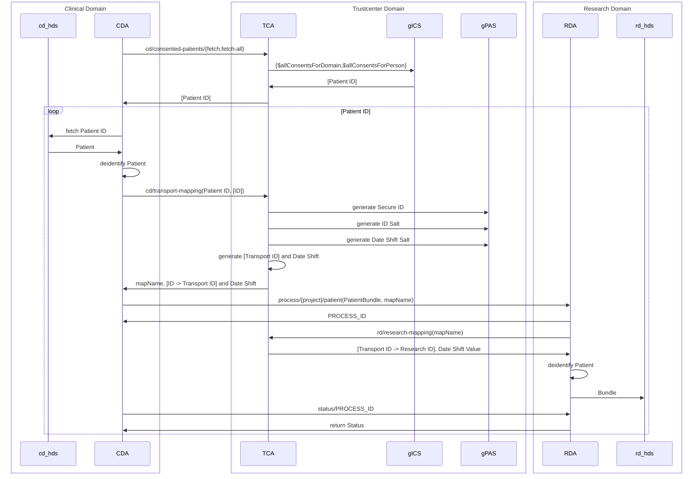

# FTS Development

Welcome to the developer documentation for the FHIR Transfer Services project! This document is
intended to guide developers through the codebase, architecture, and development practices.

***Note:** This documentation may be outdated, and we acknowledge its current limitations. We are
actively working to enhance and update this guide to provide a more comprehensive and up-to-date
resource for developers. Your feedback is valuable in this ongoing improvement process.*

## Repository Structure

The project follows a structured organization to enhance readability and maintainability.

- `api/`
  The API of FTSnext.

- `docs/`  
  Markdown files with examples and detailed documentation for users and developers. Includes user
  guides, developer guides, release steps, and more.

- [clinical-domain-agent/](clinical-domain-agent)  
  Java code, Dockerfile, CI config snippets, and Maven configuration (`pom.xml`) for the Clinical
  Domain Agent.

- `research-domain-agent/`  
  Java code, Dockerfile, CI config snippets, and Maven configuration (`pom.xml`) for the Research
  Domain Agent.

- [trustcenter-agent/](trustcenter-agent.md)  
  Java code, Dockerfile, CI config snippets, and Maven configuration (`pom.xml`) for the Trust
  Center Agent.

- `monitoring-util/`
  A utility module to collect metrics and visualize them via Prometheus.

- `test-util/`
  Contains test utils and a FhirGenerator to generate test data.

- `util/`
  A collection of utility classes or classes shared by multiple agents.

- `.github/`  
  Contains GitHub Actions workflows and related files.
