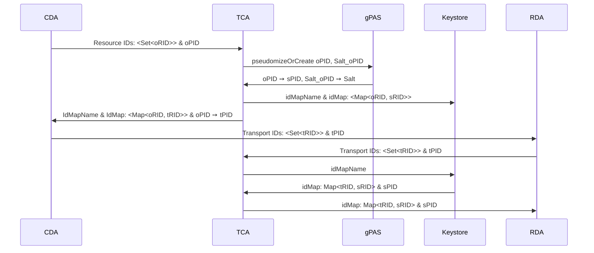

# Trustcenter Agent (TCA)

## Consent

The TCA offers an endpoint to receive a cohort of consented patients from gICS.

## De-identification

The role of the TCA for the de-identification consists of two parts:
First, the Pseudonym Provider, provides a mechanism that replaces the IDs of the CDA domain with
pseudonyms for the RDA domain, such that it is, without the TCA, impossible to re-identify
neither the IDs of the CDA domain nor the pseudonyms of the RDA domain from the other domain.
Second, the Shifted Dates Provider, offers a way to time-shift dates.

### Pseudonym Provider

We distinguish between the Patient ID (PID) and other Resource IDs (RID)s.
The original PID (oPID) from the CDA domain is sent to gPAS where a pseudonym or secure PID (sPID)
is created.
The oRIDs are hashed with sha256 to create secure RIDs (sRID)s.
Since we have no influence about the ids' length we add salt to the hash function.
Therefore, we send the concatenation of "Salt_" + oPID to gPAS to create a pseudonym that is used as
salt.

Next we create a transport ID for all original IDs and return Map<oRID, tRID> and oPID ➙ tPID to
the CDA.
The CDA replaces the original IDs with the transport IDs and sends the Bundle to the RDA.

The RDA asks the TCA to provide the secure IDs for the transport IDs and replaces the transport IDs.

### Shifted Dates Provider
