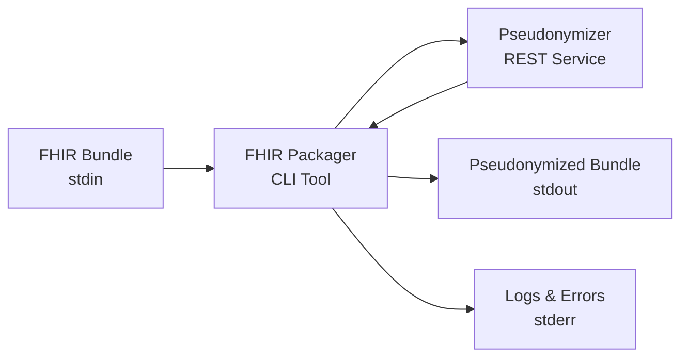
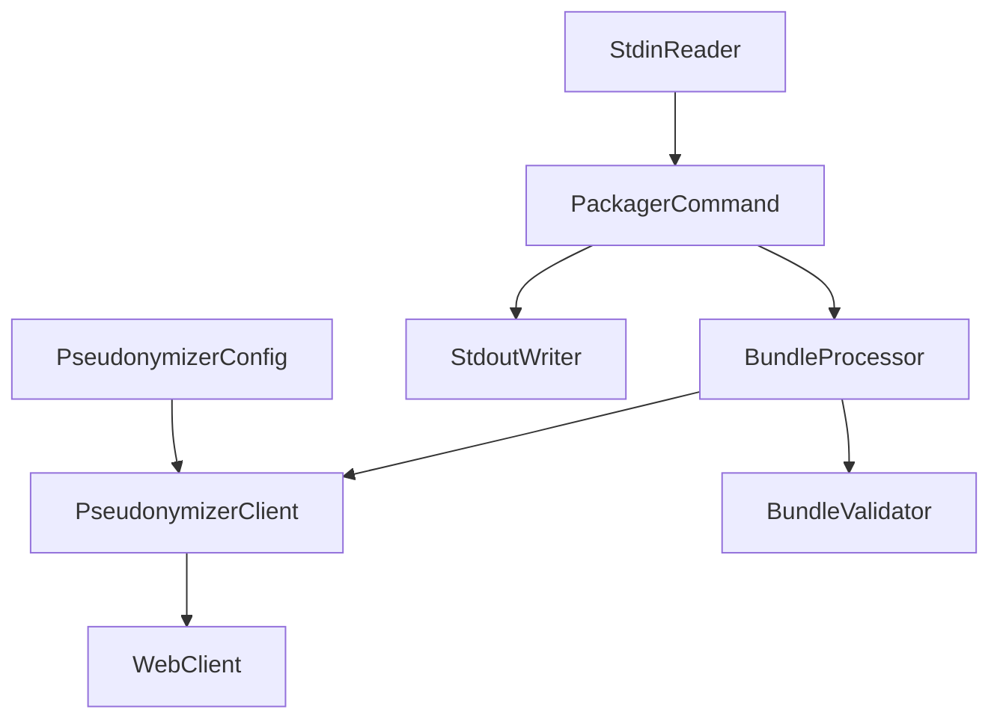

# FHIR Packager CLI Tool

The FHIR Packager is a standalone command-line tool designed for pseudonymizing FHIR Bundles through a REST service. It provides a simple, efficient way to integrate FHIR de-identification into data processing pipelines.

## Overview

The FHIR Packager operates as a Unix-style filter, reading FHIR Bundle JSON from stdin and outputting pseudonymized results to stdout. This design enables clean integration with shell pipelines and automated workflows.



### Key Features

- **Pipeline Integration**: Reads from stdin, writes to stdout
- **Flexible Configuration**: CLI args, environment variables, or YAML files
- **Robust Error Handling**: Meaningful exit codes and retry logic
- **Performance Optimized**: Handles large bundles with reactive streams
- **Security Focused**: HTTPS support, no sensitive data logging

## Architecture

The tool is built using Spring Boot (without web server) and follows these design principles:

- **Clean I/O Separation**: Data flows through stdin/stdout, logs go to stderr
- **Fail-Fast Validation**: Input validation with clear error messages
- **Reactive Processing**: Non-blocking HTTP client for service communication
- **Configurable Resilience**: Retry logic with exponential backoff

### Core Components



## Getting Started

### Prerequisites

- Java 21 or higher
- Maven 3.6+ (for building)
- Access to a FHIR Pseudonymizer REST service

### Quick Start

1. **Build the tool**:
   ```bash
   cd fhir-packager
   mvn clean package
   ```

2. **Basic usage**:
   ```bash
   cat patient-bundle.json | java -jar target/fhir-packager-*.jar > pseudonymized.json
   ```

3. **With configuration**:
   ```bash
   cat bundle.json | java -jar fhir-packager-*.jar \
     --pseudonymizer-url https://pseudonymizer.example.com \
     --timeout 60 > result.json
   ```

## Integration with FTS Ecosystem

While standalone, the FHIR Packager complements the FTS agent architecture:

- **Clinical Domain**: Can be used in custom data extraction workflows
- **Research Domain**: Useful for additional processing steps
- **Trust Center**: Independent tool for batch pseudonymization

The tool uses shared utilities from the FTS ecosystem and follows the same configuration patterns as the agents.

## Use Cases

### Data Pipeline Integration

```bash
#!/bin/bash
# Extract bundles from clinical system, pseudonymize, load to research
for patient_id in $(cat patient-list.txt); do
  curl -s "https://fhir-server/Patient/$patient_id/\$everything" | \
    java -jar fhir-packager.jar | \
    curl -X POST -H "Content-Type: application/fhir+json" \
      -d @- "https://research-server/Bundle"
done
```

### Batch Processing

```bash
# Process directory of FHIR bundles
find bundles/ -name "*.json" -exec sh -c '
  echo "Processing {}"
  cat "{}" | java -jar fhir-packager.jar > "pseudonymized/$(basename "{}")"
' \;
```

### Testing and Validation

```bash
# Validate pseudonymization workflow
cat test-bundle.json | \
  java -jar fhir-packager.jar --verbose 2>debug.log | \
  fhir-validator --validate
```

## External Dependencies

### FHIR Pseudonymizer Service

The tool requires a compatible FHIR Pseudonymizer REST service with:

- **Endpoint**: `/fhir/$de-identify` (POST)
- **Input**: FHIR Bundle (application/fhir+json)
- **Output**: Pseudonymized FHIR Bundle
- **Health Check**: `/health` (optional)

The service technology stack is agnostic - it can be implemented in any language/framework as long as it follows the REST API contract.

## Documentation Sections

- **[Installation](./fhir-packager/installation)**: Build and deployment instructions
- **[Configuration](./fhir-packager/configuration)**: Detailed configuration reference
- **[Usage](./fhir-packager/usage)**: Examples and integration patterns
- **[Troubleshooting](./fhir-packager/troubleshooting)**: Common issues and solutions

## Performance Characteristics

- **Memory Efficiency**: < 2GB overhead for large bundles
- **Processing Speed**: < 1 second overhead for typical bundles
- **Throughput**: Handles bundles up to several GB
- **Scalability**: Can be deployed in parallel for batch processing

## Security Considerations

- **Transport Security**: Supports HTTPS/TLS for service communication
- **Data Privacy**: No sensitive data logged or persisted
- **Input Validation**: Validates FHIR Bundle structure before processing
- **Error Isolation**: Service errors don't expose internal implementation details

## Next Steps

1. [Install and configure](./fhir-packager/installation) the FHIR Packager
2. Review [configuration options](./fhir-packager/configuration) for your environment
3. Explore [usage examples](./fhir-packager/usage) for integration patterns
4. Set up monitoring and [troubleshooting](./fhir-packager/troubleshooting) procedures