# FHIR Transfer Services Usage Guide

Welcome to the FHIR Transfer Services user guide! This guide will help you get started with running
the FHIR Transfer Services components: Clinical Domain Agent (CDA), Research Domain Agent (RDA),
and Trust Center Agent (TCA).

## Getting Started

1. [Prerequisites](./usage/prerequisites)
2. [Installation](./usage/installation)
3. [Configuration](./usage/configuration)
4. [Execution](./usage/execution)

## Overview

FTSnext is built for the transfer of FHIR data from the clinical domain to the research domain
while ensuring the Patients' privacy. Therefore, the data are de-identified by removing specific
data, replacing IDs with pseudonymized IDs, and shifting the dates by a random value.

The following sequence diagram gives an overview of FTSnext's functionality.

```mermaid
sequenceDiagram
    CDA ->> TCA: request consented Patients
    TCA ->> CDA: List of Patient IDs

    loop for each Patient ID
        CDA ->> CDA: scrape IDs and dates
        CDA ->> TCA: request Transport Mapping (IDs + date tID mappings)
        TCA ->> CDA: Transport Mapping and Date Shift Mappings
        CDA ->> CDA: attach tID extensions, null dates
        CDA ->> RDA: Patient Bundle (with tID extensions)
        RDA ->> TCA: request Research Mapping
        TCA ->> RDA: Research Mapping (IDs + date tID→shiftedDate)
        RDA ->> RDA: resolve tIDs to sIDs and dates
    end
```

## Important Notes

* **Domain prerequisite**: Any domains referenced in FTSnext configuration must be pre-created in
  your consent and pseudonym management systems. FTSnext does not have the capability to create or
  alter domains.
