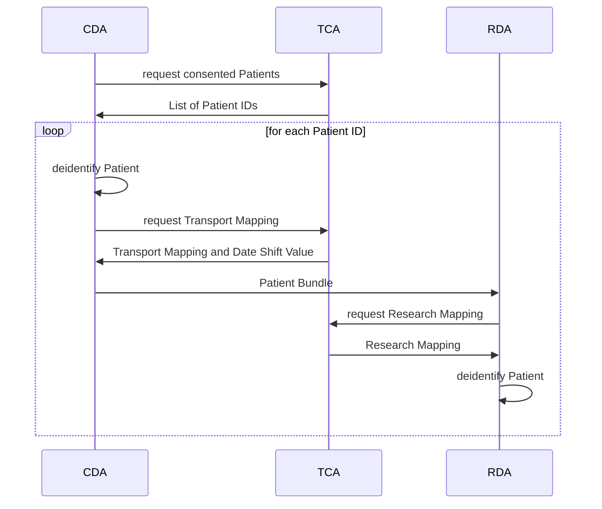

# FHIR Transfer Services Usage Guide

Welcome to the FHIR Transfer Services user guide! This guide will help you get started with running
the FHIR Transfer Services components: [Clinical Domain Agent (CDA)](clinical-domain-agent),
[Research Domain Agent (RDA)](research-domain-agent), and
[Trust Center Agent (TCA)](trustcenter-agent). As the three components are intended to be run in
different "domains" of a data integration center, running and configuring each component will be
described in respective documents.

## Overview

FTS is built for the transfer of FHIR data from the clinical domain to the research domain
while ensuring the Patients' anonymity. Therefore, the data are de-identified by removing specific
data, replacing IDs with pseudonymized IDs, and shifting the dates by a random value.

The following sequence diagram gives an overview of FTSnext's functionality.



# Monitoring

FTSnext provides a monitoring docker container with Grafana dashboards that show some metrics.
To work, the agent networks in `monitoring/compose.yaml` must be set accordingly.

# Deployment

For each agent, we offer a template docker setup for download.

| Agent    |                                  URL |
|:---------|-------------------------------------:|
| CDA      | https://fts-download-24/cd-agent.zip |
| TCA      | https://fts-download-24/tc-agent.zip |
| RDA      | https://fts-download-24/rd-agent.zip |
| **TODO** |               **Fix download paths** |

For example, to download and unpack the cd-agent:

```shell
TODO
curl download-link-to/cd-agent-template.zip
unzip cd-agent-template.zip
```

It will provide the following directory structure:

```shell
cd-agent/
├── application.yml
├── compose.yml
└── projects
    ├── example
    │   └── deidentifhir
    └── example.yml
```

In the `application.yml` are server related settings e.g. SSL certificates or the path to the
project setting files. The `projects/example.yml` shows the settings for an exemplary transfer
project.

**Note**:
Only CDA and RDA have projects.

## TLS

For each agent, configure the SSL settings in its application.yml file using the following
properties:

```yaml
server:
  ssl:
    enabled: true # enable SSL (TODO: not sure if necessary)
    bundle: server # indicate that the server uses its own certificate and private key

spring:
  ssl:
    bundle:
      pem:
        server:
          keystore:
            certificate: path/to/server.crt # path to the server's certificate file in PEM format
            private-key: path/to/server.key # path to the server's private key file in PEM format
          truststore:
            certificate: path/to/ca.crt # path to the server's truststore certificate (CA certificate) in PEM format
        client: # the agent needs to trust the certificates of the other agents
          truststore:
            certificate: path/to/ca.crt # path to the client's truststore certificate (CA certificate) in PEM format
```

## Authentication & Authorization

FTSnext offers several authentication & authorization methods: None, Basic, and Certificates. The
configuration is defined in the security section of the agents' `application.yml`.

### None

This method should be used for testing purposes only or if you fully understand the security
implications.

### Basic

The CDA expects only request from the user e.g. via its start endpoint.

```yaml
security:
  auth:
    basic:
      users:
      - username: client
        password: "{bcrypt}$2a$10$4i1TQpnBlcKOdUYO9O850.jJ8yGO8x9fQuu/l3Ki3HXgv0t9NOr4y"
        # password: "{noop}2mXA742aw7CGaLU6"
        role: client
```

The TCA connects with both CDA and RDA, thus it needs to allow both agents:

```yaml
security:
  auth:
    basic:
      users:
      - username: cd-agent
        password: "{bcrypt}$2a$10$S7FXGqbbci2YOjBAAaeC9.KaTP8sZ2Hyi5d3aub1L..oe3L2kqv/K"
        # password: "{noop}Aj6cloJYsTpu+op+"
        role: cd
      - username: rd-agent
        password: "{bcrypt}$2a$10$m0kteW3J47snneNzGTzkzeAtGo8FfODkmPP0uLXOz8uRvkc5Lqwme"
        # password: "{noop}1J5MhEhhiGh33dgt"
        role: rd
```

The password can be specified in different formats:

Password formats:

- {bcrypt}: Indicates that the password is hashed using the BCrypt algorithm. The password should be
  in the format `{bcrypt}$2a$10$<hash>`, where `<hash>` is the BCrypt hash of the actual password.
- {noop}: Indicates that the password is stored in plain text (not recommended for production use).
  The password should be in the format `{noop}<password>`, where `<password>` is the actual
  password.

TODO: Wo speichern RDA und CDA die pwds für TCA?

The RDA receives patient data from the CDA

```yaml
security:
  auth:
    basic:
      users:
      - username: cd-agent
      password: "{bcrypt}$2a$10$kUT57nDMEPtigO3BtsD/UeQMLsBDsOwu4iFVAEcgucPbD1zGaHI5y"
      # password: "{noop}bdfXkmQQIQLEkvVq"
      role: cd-agent
```

### Certificates
