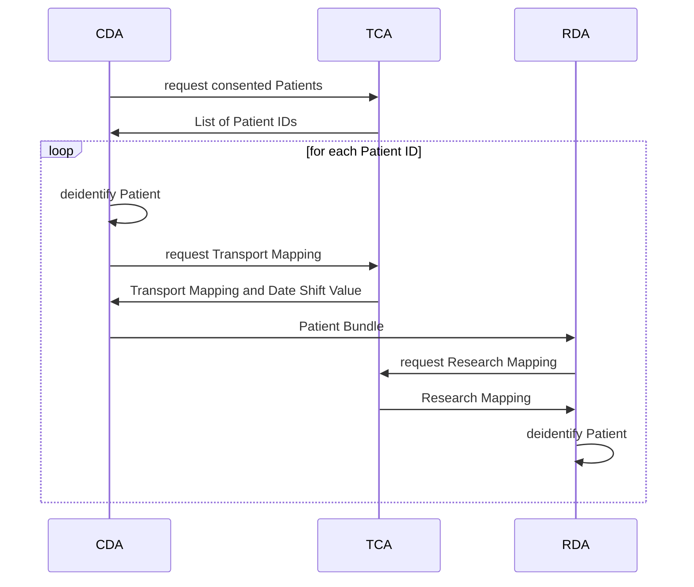

# FHIR Transfer Services Usage Guide

Welcome to the FHIR Transfer Services user guide! This guide will help you get started with running
the FHIR Transfer Services
components: [Clinical Domain Agent (CDA)](clinical-domain-agent), [Research Domain Agent (RDA)](research-domain-agent),
and [Trust Center Agent (TCA)](trustcenter-agent). As the three components are intended to be run
in different "domains" of a data integration center, running and configuring each component will be
described in respective documents.

## Overview

The following sequence diagram gives an overview of FTSnext's functionality.

```mermaid
sequenceDiagram
    CDA ->> TCA: request consented Patients
    TCA ->> CDA: List of Patient IDs
    
    loop for each Patient ID
    CDA ->> CDA: deidentify Patient
    CDA ->> TCA: request Transport Mapping
    TCA ->> CDA: Transport Mapping and Date Shift Value
    CDA ->> RDA: Patient Bundle
    RDA ->> TCA: request Research Mapping
    TCA ->> RDA: Research Mapping
    RDA ->> RDA: deidentify Patient
    end
```
