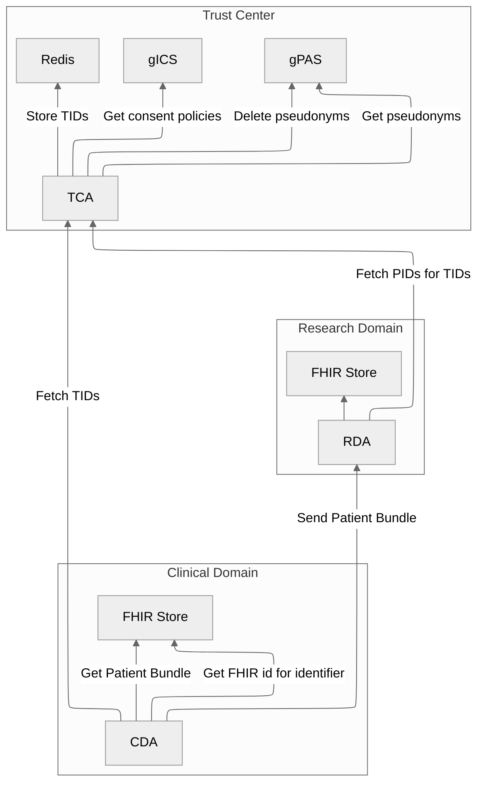

```mermaid
%%{init: {"flowchart": {"defaultRenderer": "elk"}, "theme":"neutral"} }%%
flowchart BT
    subgraph Trust Center
        tca[TCA] -->|Get consent policies| gics[gICS]
        tca -->|Get pseudonyms| gpas[gPAS]
        tca -->|Delete pseudonyms| gpas
        tca -->|Store TIDs| redis[Redis]
    end

    subgraph Clinical Domain
        cda[CDA] -->|Get FHIR id for identifier| cda_fhir_store[FHIR Store]
        cda[CDA] -->|Get Patient Bundle| cda_fhir_store[FHIR Store]
    end

    subgraph Research Domain
        rda[RDA] --> rda_fhir_store[FHIR Store]
    end

    cda -->|Fetch TIDs| tca
    cda -->|Send Patient Bundle| rda
    rda -->|Fetch PIDs for TIDs| tca
    
```
