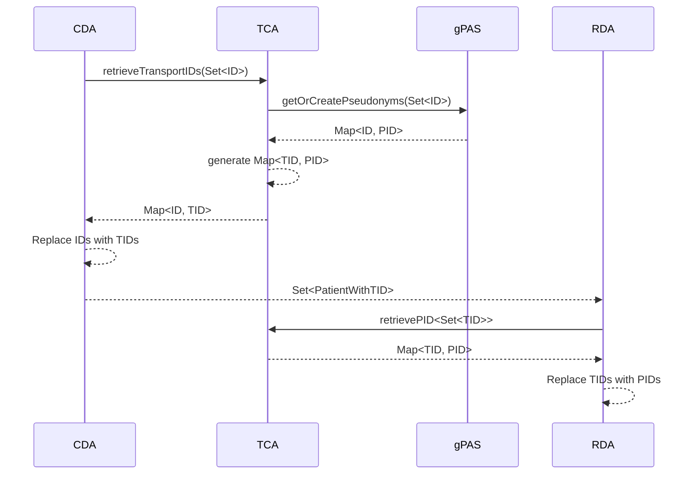

# FTS Trust Center Agent Development

## Configuration

## TransportID & Pseudonym Generation

The diagram illustrates the sequence of interactions between four entities in a system: CDA (Clinical Domain Agent),
TCA (Trust Center Agent), gPAS (Pseudonymization Service), and RDA (Research Domain Agent). Here’s a detailed
explanation of each step in the sequence:

1. **CDA to TCA: retrieveTransportIDs(Set<ID>)**
    - **Description:** The CDA initiates the process by sending a request to the TCA. This request includes a Set of IDs
      for which transport IDs are needed.
    - **Entities Involved:** CDA, TCA
    - **Message:** `Set<ID>`

2. **TCA to gPAS: getOrCreatePseudonyms(Set<ID>)**
    - **Description:** Upon receiving the request, the TCA forwards the Set of IDs to the gPAS. This service is
      responsible
      for generating or retrieving pseudonyms for the given IDs.
    - **Entities Involved:** TCA, gPAS
    - **Message:** `Set<ID>`

3. **gPAS to TCA: Map<ID, PID>**
    - **Description:** The gPAS returns a map that associates each ID with a corresponding pseudonym (PID).
    - **Entities Involved:** gPAS, TCA
    - **Message:** `Map<ID, PID>`

4. **TCA: generate Map<TID, PID>**
    - **Description:** The TCA internally processes the received map and generates a new map that associates transport
      IDs (
      TID) with the pseudonyms (PID). This step is internal to the TCA and does not involve any message passing between
      entities.

5. **TCA to CDA: Map<ID, TID>**
    - **Description:** The TCA sends back to the CDA a map that links each original ID with its corresponding transport
      ID.
    - **Entities Involved:** TCA, CDA
    - **Message:** `Map<ID, TID>`

6. **CDA: replace IDs with TIDs**
    - **Description:** The CDA replaces all original IDs with their transport ID.

7. **CDA to RDA: Set<PatientWithTID>**
    - **Description:** The CDA then sends a Set of patients, now associated with their transport IDs, to the RDA.
    - **Entities Involved:** CDA, RDA
    - **Message:** `Set<PatientWithTID>`

8. **RDA to TCA: retrievePID<Set<TID>>**
    - **Description:** The RDA, needing the pseudonyms for research purposes, sends a request to the TCA to retrieve the
      pseudonyms associated with the Set of transport IDs.
    - **Entities Involved:** RDA, TCA
    - **Message:** `Set<TID>`

9. **TCA to RDA: Map<TID, PID>**
    - **Description:** The TCA responds by providing a map that links each transport ID with its corresponding
      pseudonym.
    - **Entities Involved:** TCA, RDA
    - **Message:** `Map<TID, PID>`

10. **TCA: replace TIDs with PIDs**
    - **Description:** The CDA replaces all transport IDs with their pseudonym.
